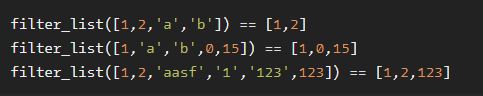

# List Filtering

**문제 설명**

In this kata you will create a function that takes a list of non-negative integers and strings and returns a new list with the strings filtered out.

**입출력 예**



**Solution**

```javascript
function filter_list(l) {
  const res = l.filter(function (item) {
    return typeof item === "number";
  });

  return res;
}
```
