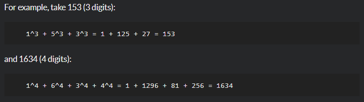

# Does my number look big in this?

**문제 설명**

A Narcissistic Number is a number which is the sum of its own digits, each raised to the power of the number of digits in a given base. In this Kata, we will restrict ourselves to decimal (base 10).

The Challenge:

Your code must return true or false depending upon whether the given number is a Narcissistic number in base 10.

Error checking for text strings or other invalid inputs is not required, only valid integers will be passed into the function.

**입출력 예**



**Solution**

```javascript
function narcissistic(value) {
  const digits = value.toString().length;
  const number = value.toString().split("");
  let res = 0;

  for (let i = 0; i < number.length; i++) {
    res += Number(number[i] ** digits);
  }

  return res === value ? true : false;
}
```

**Clever Solution**

```javascript
function narcissistic(value) {
  return (
    ("" + value).split("").reduce(function (p, c) {
      return p + Math.pow(c, ("" + value).length);
    }, 0) == value
  );
}
```
