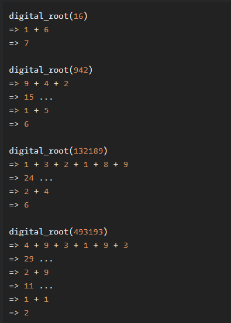

# Sum of Digits / Digital Root

**문제 설명**

In this kata, you must create a digital root function.

A digital root is the recursive sum of all the digits in a number. Given n, take the sum of the digits of n. If that value has more than one digit, continue reducing in this way until a single-digit number is produced. This is only applicable to the natural numbers.

Here's how it works:

**입출력 예**



**Solution**

```javascript
function digital_root(n) {
  const string = n.toString().split("");
  if (n < 10) return n;

  return digital_root(
    string.reduce((acc, cur) => {
      return acc + +cur;
    }, 0)
  );
}
```
