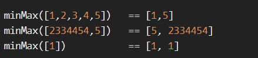

# The highest profit wins!

**문제 설명**

Story
Ben has a very simple idea to make some profit: he buys something and sells it again. Of course, this wouldn't give him any profit at all if he was simply to buy and sell it at the same price. Instead, he's going to buy it for the lowest possible price and sell it at the highest.

Task
Write a function that returns both the minimum and maximum number of the given list/array.

**입출력 예**



**Solution**

```javascript
function minMax(arr) {
  let res = [];

  res.push(Math.min(...arr));
  res.push(Math.max(...arr));
  return res;
}
```

**Clever Solution**

```javascript
function minMax(arr) {
  return [Math.min(...arr), Math.max(...arr)];
}
```
