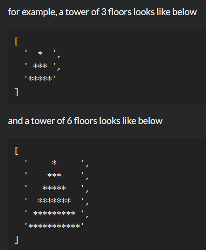

# Build Tower

**문제 설명**

Build Tower by the following given argument:
number of floors (integer and always greater than 0).

Tower block is represented as \*

Python: return a list;
JavaScript: returns an Array;
C#: returns a string[];
PHP: returns an array;
C++: returns a vector<string>;
Haskell: returns a [String];
Ruby: returns an Array;
Have fun!

**입출력 예**



**Solution**

```javascript
function towerBuilder(n) {
  return Array.from({ length: n }, function (v, k) {
    const spaces = " ".repeat(n - k - 1);
    return spaces + "*".repeat(k + k + 1) + spaces;
  });
}
```
