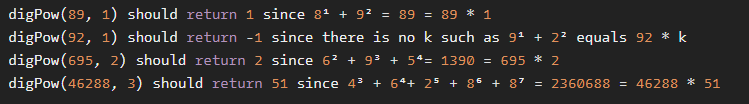

# Playing with digits

**문제 설명**

Some numbers have funny properties. For example:

89 --> 8¹ + 9² = 89 \* 1

695 --> 6² + 9³ + 5⁴= 1390 = 695 \* 2

46288 --> 4³ + 6⁴+ 2⁵ + 8⁶ + 8⁷ = 2360688 = 46288 \* 51

Given a positive integer n written as abcd... (a, b, c, d... being digits) and a positive integer p

we want to find a positive integer k, if it exists, such as the sum of the digits of n taken to the successive powers of p is equal to k \* n.
In other words:

Is there an integer k such as : (a ^ p + b ^ (p+1) + c ^(p+2) + d ^ (p+3) + ...) = n \* k

If it is the case we will return k, if not return -1.

Note: n and p will always be given as strictly positive integers.

**입출력 예**



**Solution**

```javascript
function digPow(n, p) {
  const powed = (n + "").split("").reduce((acc, cur, idx, _) => {
    return acc + Math.pow(parseInt(cur), idx + p);
  }, 0);
  if (parseInt(powed / n) === powed / n) {
    return parseInt(powed / n);
  } else {
    return -1;
  }
}
```

**Clever Solution**

```javascript
function digPow(n, p) {
  var x = String(n)
    .split("")
    .reduce((s, d, i) => s + Math.pow(d, p + i), 0);
  return x % n ? -1 : x / n;
}
```
