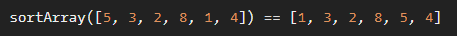

# Sort the odd

**문제 설명**

You have an array of numbers.
Your task is to sort ascending odd numbers but even numbers must be on their places.

Zero isn't an odd number and you don't need to move it. If you have an empty array, you need to return it.

**입출력 예**



**Solution**

```javascript
function sortArray(array) {
  const odd = array.filter((item) => item % 2).sort((a, b) => a - b);
  return array.map((x) => (x % 2 ? odd.shift() : x));
}
```
