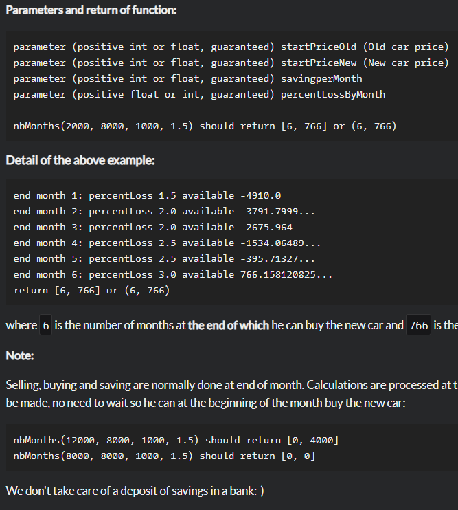

# Buying a car

**문제 설명**

Let us begin with an example:

A man has a rather old car being worth $2000. He saw a secondhand car being worth $8000. He wants to keep his old car until he can buy the secondhand one.

He thinks he can save \$1000 each month but the prices of his old car and of the new one decrease of 1.5 percent per month. Furthermore this percent of loss increases of 0.5 percent at the end of every two months. Our man finds it difficult to make all these calculations.

Can you help him?

How many months will it take him to save up enough money to buy the car he wants, and how much money will he have left over?

**Detail of the above example**



**Solution**

```javascript
function nbMonths(
  startPriceOld,
  startPriceNew,
  savingperMonth,
  percentLossByMonth
) {
  let month = 0;
  let totalSavingPrice = 0;
  while (startPriceOld + totalSavingPrice < startPriceNew) {
    month++;
    if (month % 2 === 0) percentLossByMonth += 0.5;
    totalSavingPrice += savingperMonth;
    startPriceOld -= startPriceOld * (percentLossByMonth / 100);
    startPriceNew -= startPriceNew * (percentLossByMonth / 100);
  }
  return [month, Math.round(startPriceOld + totalSavingPrice - startPriceNew)];
}
```
