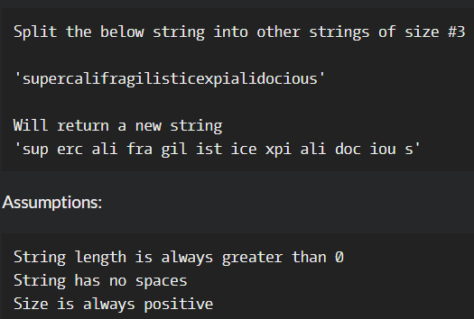

# Split In Parts

**문제 설명**

The aim of this kata is to split a given string into different strings of equal size (note size of strings is passed to the method)

**입출력 예**



**Solution**

```javascript
const splitInParts = function (s, partLength) {
  let res = [];
  for (let i = 0; i < s.length; i += partLength) {
    res.push(s.substring(i, i + partLength));
  }
  return res.join(" ");
};
```
