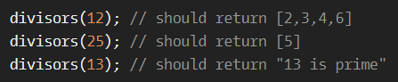

# Find the divisors!

**문제 설명**

Create a function named `divisors/Divisors` that takes an integer `n > 1` and returns an array with all of the integer's divisors(except for 1 and the number itself), from smallest to largest. If the number is prime return the string '(integer) is prime' (`null` in C#) (use Either String a in Haskell and Result<Vec<u32>, String> in Rust).

**입출력 예**



**Solution**

```javascript
function divisors(integer) {
  let divisor = [];
  for (let i = 1; i <= integer; i++) {
    if (integer % i === 0) {
      divisor.push(i);
    }
  }
  divisor.shift();
  divisor.pop();
  if (divisor.length < 1) return `${integer} is prime`;
  return divisor;
}
```

**Clever Solution**

```javascript
function divisors(integer) {
  var res = [];
  for (var i = 2; i <= Math.floor(integer / 2); ++i)
    if (integer % i == 0) res.push(i);
  return res.length ? res : integer + " is prime";
}
```
