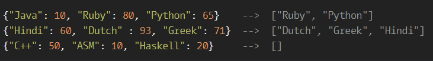

# My Languages

**문제 설명**

You are given a dictionary/hash/object containing some languages and your test results in the given languages. Return the list of languages where your test score is at least 60, in descending order of the results.

Note: the scores will always be unique (so no duplicate values)

**입출력 예**



**Solution**

```javascript
function myLanguages(results) {
  let yourTask = [];
  for (let key in results) {
    if (results[key] >= 60) {
      yourTask.push(key);
    }
  }
  yourTask = yourTask.sort((a, b) => {
    return results[b] - results[a];
  });
  return yourTask;
}
```

**Clever Solution**

```javascript
function myLanguages(results) {
  return Object.keys(results)
    .filter((r) => results[r] > 59)
    .sort((a, b) => results[b] - results[a]);
}
```
