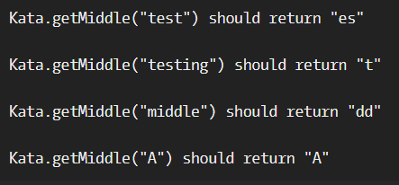

# Get the Middle Character

**문제 설명**

You are going to be given a word. Your job is to return the middle character of the word. If the word's length is odd, return the middle character. If the word's length is even, return the middle 2 characters.

**입출력 예**



**Input**

A word (string) of length 0 < str < 1000 (In javascript you may get slightly more than 1000 in some test cases due to an error in the test cases). You do not need to test for this. This is only here to tell you that you do not need to worry about your solution timing out.

**Output**

The middle character(s) of the word represented as a string.

**Solution**

```javascript
function getMiddle(s) {
  let middle = Math.round(s.length / 2 - 1);
  if (middle < 0) return s;
  return s.length % 2 === 0 ? s.substr(middle, 2) : s.substr(middle, 1);
}
```
