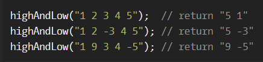

# Highest and Lowest

**문제 설명**

In this little assignment you are given a string of space separated numbers, and have to return the highest and lowest number.

**입출력 예**



**Notes**

All numbers are valid Int32, no need to validate them.
There will always be at least one number in the input string.
Output string must be two numbers separated by a single space, and highest number is first.

**Solution**

```javascript
function highAndLow(numbers) {
  const toNumbers = numbers.split(" ").map((item) => {
    return +item;
  });
  return `${Math.max(...toNumbers)} ${Math.min(...toNumbers)}`;
}
```
