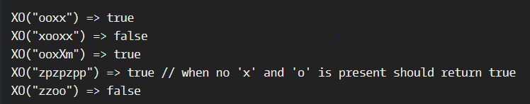

# Exes and Ohs

**문제 설명**

Check to see if a string has the same amount of 'x's and 'o's. The method must return a boolean and be case insensitive. The string can contain any char.

**입출력 예**



**Solution**

```javascript
function XO(str) {
  return (str.match(/x/gi) || []).length === (str.match(/o/gi) || []).length;
}
```
