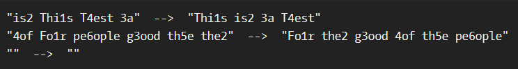

# Your order, please

**문제 설명**

Your task is to sort a given string. Each word in the string will contain a single number. This number is the position the word should have in the result.

Note: Numbers can be from 1 to 9. So 1 will be the first word (not 0).

If the input string is empty, return an empty string. The words in the input String will only contain valid consecutive numbers.

**입출력 예**



**Solution**

```javascript
function order(words) {
  let res = [];
  const sortedWords = words.length > 0 ? words.match(/[1-9]/g).sort() : [];
  const wordsArr = words.split(" ");

  for (let i = 0; i < sortedWords.length; i++) {
    for (let j = 0; j < wordsArr.length; j++) {
      if (wordsArr[j].includes(sortedWords[i])) {
        res.push(wordsArr[j]);
      }
    }
  }
  return res.join(" ");
}
```

**Clever Solution**

```javascript
function order(words) {
  return words
    .split(" ")
    .sort(function (a, b) {
      return a.match(/\d/) - b.match(/\d/);
    })
    .join(" ");
}
```
