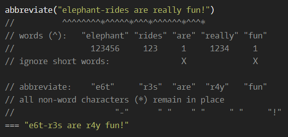

# Word a10n (abbreviation)

**문제 설명**

The word `i18n` is a common abbreviation of `internationalization` in the developer community, used instead of typing the whole word and trying to spell it correctly. Similarly, `a11y` is an abbreviation of `accessibility`.

Write a function that takes a string and turns any and all "words" (see below) within that string of length 4 or greater into an abbreviation, following these rules:

- A "word" is a sequence of alphabetical characters. By this definition, any other character like a space or hyphen (eg. "elephant-ride") will split up a series of letters into two words (eg. "elephant" and "ride").
- The abbreviated version of the word should have the first letter, then the number of removed characters, then the last letter (eg. "elephant ride" => "e6t r2e").

**입출력 예**



**Solution**

```javascript
function abbreviate(string) {
  return string.replace(/\w{4,}/g, function (word) {
    return word[0] + (word.length - 2) + word.slice(-1);
  });
}
```
