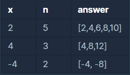

# 프로그래머스 알고리즘 코딩테스트연습 - x만큼 간격이 있는 n개의 숫자

**문제 설명**

함수 solution은 정수 x와 자연수 n을 입력 받아, x부터 시작해 x씩 증가하는 숫자를 n개 지니는 리스트를 리턴해야 합니다. 다음 제한 조건을 보고, 조건을 만족하는 함수, solution을 완성해주세요.

**제한 조건**

- x는 -10000000 이상, 10000000 이하인 정수입니다.
- n은 1000 이하인 자연수입니다.

**입출력 예**



**Solution**

```javascript
function solution(x, n) {
  let count = 0;
  let res = [];
  while (count < n) {
    count++;
    res.push(x * count);
  }
  return res;
}
```

**다른 사람의 풀이**

```javascript
function solution(x, n) {
  return Array(n)
    .fill(x)
    .map((v, i) => (i + 1) * v);
}
```
