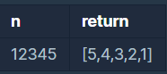

# 프로그래머스 알고리즘 코딩테스트연습 - 자연수 뒤집어 배열로 만들기

**문제 설명**

자연수 n을 뒤집어 각 자리 숫자를 원소로 가지는 배열 형태로 리턴해주세요. 예를들어 n이 12345이면 [5,4,3,2,1]을 리턴합니다.

**제한 조건**

- n은 10,000,000,000이하인 자연수입니다.

**입출력 예**



**Solution**

```javascript
function solution(n) {
  return n
    .toString()
    .split("")
    .reverse()
    .map((item) => {
      return +item;
    });
}
```
